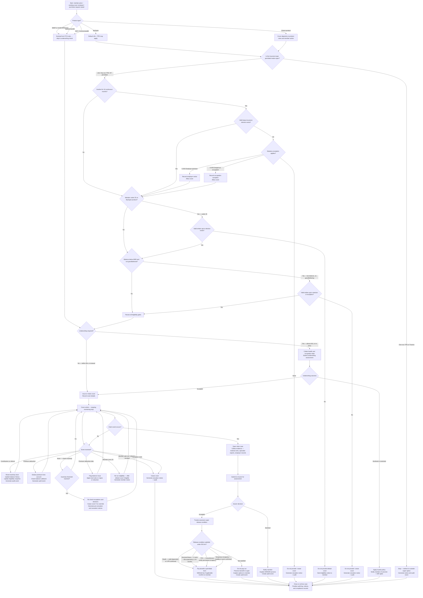

# Purchase / Retain Life & TPD Insurance in Superannuation

**Planned tool module:** `backend/app/tools/implementations/life_tpd_in_super.py`
**Frontend engine (planned):** `frontend/lib/tools/purchaseRetainLifeTPDInSuper/`
**Engine version:** 1.0.0 (planned)
**Jurisdiction:** Australia — APRA-regulated superannuation environment
**Legislation as of:** 2026-03-23

---

## Reconciliation with Previously Built Related Tools

This module is Tool 3. Before any implementation begins, engineers must review and align with:

### Tool 1 — `purchase_retain_life_insurance_in_super`
**Docs:** `docs/product-overview/life-insurance-cover-in-super.md`
**Backend:** `backend/app/tools/implementations/life_insurance_in_super.py`
**Frontend:** `frontend/lib/tools/purchaseRetainLifeInsuranceInSuper/`

Covers: SIS Act s68AAA PYS switch-off rules for **life insurance only** in super. Evaluates inactivity, low-balance, and under-25 gates. Evaluates seven statutory exceptions. Produces legal status + placement score.

**Shared logic to reuse:** all switch-off trigger evaluation, all exception evaluation, placement scoring dimensions, beneficiary tax risk, advice readiness, member action generation, audit trace format, missing-info-questions format.

### Tool 2 — `purchase_retain_life_tpd_policy`
**Docs:** `docs/product-overview/purchase-retain-life-tpd-policy.md`
**Backend:** `backend/app/tools/implementations/life_tpd_policy.py`
**Frontend:** `frontend/lib/tools/purchaseRetainLifeTPDPolicy/`

Covers: Life and TPD insurance **outside super** (and structurally agnostic). Need analysis, policy comparison, underwriting risk, replacement risk, 13-rule rule engine.

**Shared logic to reuse:** life need calculation formula, TPD need calculation formula (PV annuity), affordability analysis, underwriting risk scoring, replacement risk assessment, compliance flags generation, required actions format, rule trace structure, recommendation type constants.

### What Tool 3 adds

Tool 3 is the **superannuation-specific combined lifecycle module** for both Life and TPD insurance inside super. It extends Tool 1 (which covers only life-in-super eligibility) and Tool 2 (which covers outside-super need analysis) to produce a complete in-super lifecycle covering:
- both Life and TPD eligibility inside super
- the full claims handling pipeline
- trustee release-condition determination (separate from insurer acceptance)
- premium deduction and contribution monitoring
- cessation, reinstatement, and re-eligibility logic
- all compliance notices, audit events, and reporting obligations

---

## SECTION 1 — RESEARCH RECAP

### 1.1 Governing Legislation

| Instrument | Relevance |
|---|---|
| Superannuation Industry (Supervision) Act 1993 (Cth) — "SIS Act" | Primary law governing insurance inside super; s67A permitted events, s68AAA switch-off rules, s57–s65 trustee obligations |
| Superannuation Industry (Supervision) Regulations 1994 (Cth) — "SIS Regs" | Detailed rules on insurance, accounts, notices, and elections |
| Life Insurance Act 1995 (Cth) | Policy definition standards, insurer licensing, claims obligations |
| Corporations Act 2001 (Cth) | Financial product advice duties, SOA/FSG obligations, DDO/TMD requirements |
| Income Tax Assessment Act 1997 (Cth) — "ITAA97" | Tax treatment of insurance premiums and benefits inside super |
| Income Tax Assessment Act 1936 (Cth) — "ITAA36" | Historical provisions still relevant to taxed/untaxed elements |
| Privacy Act 1988 (Cth) | Australian Privacy Principles (APPs) — health data, claims data, consent |
| Treasury Laws Amendment (Protecting Your Super Package) Act 2019 (Cth) | Commenced 1 July 2019 — PYS reforms; inactivity, low-balance, under-25 rules |
| Treasury Laws Amendment (Putting Members' Interests First) Act 2019 (Cth) | Commenced 1 April 2020 — under-25 and low-balance default insurance prohibition |

---

### 1.2 APRA Prudential Standards

| Standard | Key obligations |
|---|---|
| SPS 250 Insurance in Superannuation | Trustee must have an insurance strategy; strategy must address appropriateness of cover types, levels, and costs; annual review required; claims handling obligations |
| SPS 220 Risk Management | Risk framework must address insurance administration risks |
| SPS 515 Strategic Planning and Member Outcomes | Insurance outcomes must be assessed in the annual member outcomes assessment |
| CPS 234 Information Security | Member insurance data must meet information security obligations (applies to APRA-regulated entities) |
| CPS 230 Operational Resilience | Insurance administration processes must be within operational resilience framework |

---

### 1.3 ASIC Regulatory Guidance

| Guidance | Key obligations |
|---|---|
| RG 175 Licensing: Financial product advisers — conduct and disclosure | Replacement of insurance requires clear documentation that new policy is better; best interests duty applies |
| RG 271 Internal Dispute Resolution | Trustee and insurer must have compliant IDR processes for claims disputes |
| RG 256 Client review and remediation | Applies where trustees or advisers identify systemic insurance failures |
| INFO 258 Advice to superannuation members | ASIC guidance on giving advice about insurance in super |

---

### 1.4 ATO Tax Rules

| Rule | Details |
|---|---|
| Premium deductions inside super | Premiums for death, TPD, and income protection are generally deductible to the fund under ITAA97 s295-465 |
| Tax on insurance proceeds inside super | Life/death benefits paid to tax dependants: tax-free. Paid to non-dependants: up to 17% (15% + 2% Medicare) on taxable component (ITAA97 s302-195). TPD benefits: treatment depends on release condition pathway and taxed/untaxed elements |
| Concessional contributions — 15% fund tax | Premiums funded from concessional contributions are effectively tax-advantaged vs personal after-tax premiums |
| Disability superannuation benefit | A TPD benefit paid from super must satisfy the "permanent incapacity" release condition or the "terminal medical condition" condition. The tax treatment differs depending on the pathway |
| Tax file number (TFN) obligations | Member TFN must be held for correct tax withholding on insurance proceeds |

---

### 1.5 Permitted Insurance Types Inside Super (SIS Act s67A)

Only insurance that covers an "insured event" that is consistent with a superannuation condition of release may be provided inside super:

| Insurance type | Permitted in super? | Release condition alignment |
|---|---|---|
| Life (death) cover | Yes | Death condition of release |
| Terminal medical condition cover | Yes | Terminal medical condition release condition |
| Total and Permanent Disability (TPD) | Yes — but TPD definition must be "any occupation" or broader. Own-occupation TPD is NOT permitted inside super (SIS Act s67A(2)) | Permanent incapacity |
| Temporary incapacity / income protection | Yes — limited to income protection covering temporary incapacity (SIS Regs reg 1.07D, 1.07DA) | Temporary incapacity |
| Trauma / critical illness | Generally NO — no matching release condition in most cases |
| Income protection on own-occupation basis | Allowed with care — definition must be consistent with temporary incapacity |

**Critical rule for TPD:** SIS Act s67A(2) prohibits TPD insurance inside super where the definition of TPD is more restrictive than "any occupation". An "own-occupation" TPD policy held outside super cannot simply be moved inside super — doing so requires an "any-occupation" or equivalent definition.

---

### 1.6 Protecting Your Super (PYS) — Switch-Off Rules (SIS Act s68AAA)

Three automatic switch-off triggers. Each must be checked independently and in order:

**Trigger 1: Inactivity (s68AAA(1)(a))**
- Fires if no contribution or rollover has been credited for 16 consecutive months
- Once fired, the trustee must cease charging the account for insurance premiums
- Overridable by: member election (opt-in), employer exception, dangerous occupation exception, ADF exception, small fund exception, defined benefit exception, SFT exception

**Trigger 2: Low Balance (s68AAA(1)(b))**
- Fires if account balance is below $6,000
- Does NOT fire if the account balance was at or above $6,000 on or after 1 November 2019 (grandfathering)
- Overridable by: same exceptions as Trigger 1

**Trigger 3: Under-25 (s68AAA(3))**
- Applies to MySuper products only
- Trustee must not provide default insurance to members under 25 without a member opt-in direction
- Not overridable by employer exception or dangerous occupation — ONLY the member's own written election can override
- Applies differently from Triggers 1 and 2 — it is a prohibition on default provision, not a switch-off of existing cover

---

### 1.7 Putting Members' Interests First (PMIF) Reforms

In addition to PYS, the PMIF Act extended the under-25 prohibition and the low-balance prohibition:
- Under-25 prohibition applies to all MySuper products from 1 April 2020
- Low-balance prohibition ($6,000 threshold) also commenced 1 April 2020
- These created the "default insurance gate" — new members joining MySuper products who are under 25 or have a balance below $6,000 must actively opt in to get insurance

---

### 1.8 Statutory Exceptions to PYS Switch-Off Rules

| Exception ID | Name | Conditions | Rule reference |
|---|---|---|---|
| E-001 | Small Fund Carve-Out | SMSF or small APRA fund (≤ 6 members) — s68AAA does not engage for non-RSE-licensee funds | SIS Act s68AAA |
| E-002 | Defined Benefit | Insurance is embedded in the defined benefit formula; no separate premium charge | SIS Act s68AAA |
| E-003 | ADF / Commonwealth | Commonwealth legislative framework displaces PYS obligations for ADF members | SIS Act s68AAA |
| E-004 | Employer-Paid Premium | Employer has given written notice + makes contributions exceeding SG minimum by at least the insurance fee amount | SIS Act s68AAA(4A) |
| E-005 | Dangerous Occupation | Member has lodged a valid election based on dangerous occupation status; trustee has a compliant framework | SIS Act s68AAA(4) |
| E-006 | Successor Fund Transfer | Election carried over from predecessor fund AND successor trustee has confirmed equivalent rights | SIS Act s68AAA |
| E-007 | Rights Not Affected | Cover is fixed-term or fully paid — no ongoing premium is charged, so s68AAA is not engaged | SIS Act s68AAA |

---

### 1.9 MySuper Default Insurance Requirements

Under SPS 250 and the SIS Act:
- MySuper trustees must offer default insurance where the member is eligible
- Default cover must cover death AND permanent incapacity (SIS Act s68A)
- Default cover level must be appropriate — neither excessive (eroding small balances) nor insufficient
- SPS 250 requires annual review of insurance strategy and appropriateness
- Trustees must be able to demonstrate the cost of default cover is not inappropriately reducing member balances

---

### 1.10 Claims Handling — Two-Step Process

This is the most critical compliance distinction for this module:

**Step 1: Insurer Assessment**
- The insurer assesses the claim against the policy terms
- The insurer decides whether the event qualifies under the policy (e.g., TPD definition met)
- The insurer may accept, decline, or partially accept

**Step 2: Trustee Release-Condition Determination**
- Even after insurer acceptance, the trustee must separately determine whether the member satisfies a super law release condition
- Example: insurer accepts a TPD claim → trustee must determine whether the member satisfies "permanent incapacity" under the SIS Act
- These are separate legal tests — insurer policy definitions and super law release conditions are not always aligned
- Only after BOTH steps are satisfied can the benefit be paid out of super

**Release conditions relevant to insurance claims:**
| Event | Release condition (SIS Act s62, reg 6.01) |
|---|---|
| Death | Death — benefit paid to dependants or LPR |
| Terminal illness | Terminal medical condition — 2 medical certificates + life expectancy ≤ 24 months |
| TPD | Permanent incapacity — two medical practitioners certify member is unlikely to ever be gainfully employed in any occupation for which reasonably qualified by education, training, or experience |
| Temporary incapacity / IP | Temporary incapacity — member is temporarily unable to engage in gainful employment |
| Severe financial hardship | Separate pathway — not directly tied to insurance |
| Compassionate grounds | Separate pathway — not directly tied to insurance |

---

### 1.11 Trustee vs Insurer Obligations — Roles and Splits

| Obligation | Responsible party |
|---|---|
| Insurance strategy | Trustee (SPS 250) |
| Eligibility assessment (PYS gates) | Trustee |
| Election recording | Trustee |
| Premium deduction from member account | Trustee |
| Cover terms negotiation | Trustee (group policy with insurer) |
| Policy claims notification | Trustee or member (fund-dependent) |
| Claims evidence collection | Trustee and insurer (joint) |
| Insurance claim assessment | Insurer |
| Release-condition determination | Trustee |
| Benefit payment | Trustee (after both steps above) |
| Notices to members | Trustee |
| Annual outcomes assessment | Trustee (SPS 515) |
| Dispute resolution | Trustee and insurer (IDR under RG 271) |
| Reporting to APRA | Trustee |

---

### 1.12 Privacy and Data Obligations

- Health information collected for underwriting is sensitive information under the Privacy Act (APP 3)
- Member must consent to collection of health data for underwriting purposes
- Data must not be used for any purpose other than insurance assessment (APP 6)
- Claims evidence (medical records, specialist reports) must be stored securely (APP 11)
- Where a trustee shares claim information with an insurer, a privacy notice is required

---

### 1.13 FAR Accountability Implications

Under the Financial Accountability Regime (FAR):
- Responsible persons for insurance functions must be registered
- Insurance strategy decisions (e.g., whether to maintain default cover) are accountable actions
- Significant insurance failures must be notified to APRA

---

### 1.14 Notices and Disclosure Obligations

| Trigger | Required notice | Timeframe |
|---|---|---|
| Insurance about to be switched off (inactivity) | Written notice to member — must explain reason and how to prevent cessation | Before switch-off |
| Insurance switched off | Written notice confirming cessation | Within required period |
| Insurance reactivated | Written confirmation | On reactivation |
| Change to cover terms | Significant event notice | Within 30 days |
| Claims decision | Written notice of outcome | On determination |
| Claim declined | Written notice including reasons and IDR/EDR rights | On determination |
| Annual member statement | Must include insurance details, premium amounts, and cover level | Annually |

---

## SECTION 2 — BUSINESS LOGIC

### 2.1 Entry Conditions

The module is triggered when any of the following occurs:
1. A new member joins a super product and default insurance eligibility must be assessed
2. An existing member requests to purchase additional Life or TPD cover inside super
3. An existing member's account status changes (contribution received, balance crosses threshold, member turns 25)
4. An annual insurance strategy review triggers re-assessment
5. A claim event is reported

### 2.2 Eligibility Check Sequence

The following checks are applied in strict order. A failure at any step stops the process unless an exception applies.

**Check 1: Insurance type permitted in super?**
- Life (death): permitted
- Terminal medical condition: permitted
- TPD (any occupation or broader): permitted
- TPD (own occupation): NOT permitted inside super — redirect to outside-super module
- Income protection (temporary incapacity, reasonable income replacement period): permitted with restrictions
- Trauma / critical illness: NOT permitted inside super in most cases

**Check 2: Is the fund type subject to s68AAA?**
- SMSF or small APRA fund (≤ 6 members): exempt → proceed without PYS gates
- Defined benefit: exempt → proceed with benefit-formula rules
- ADF/Commonwealth: check relevant Commonwealth framework
- All other APRA-regulated funds: proceed to PYS gate checks

**Check 3: Inactivity trigger (16 months)?**
- Has the account been inactive (no contributions or rollovers) for ≥ 16 consecutive months?
- If yes: check for valid exception or election. If none → do not provide / cease cover

**Check 4: Under-25 trigger?**
- Is the member under 25 on a MySuper product?
- If yes: check for valid member opt-in election. If none → do not provide default cover

**Check 5: Low-balance trigger?**
- Is the account balance below $6,000?
- Was the balance ever at or above $6,000 on or after 1 November 2019? If yes → grandfathered, this trigger does not apply
- If below threshold without grandfathering: check for valid exception or election. If none → do not provide / cease cover

**Check 6: Exception applies?**
- Evaluate exceptions E-001 through E-007 in priority order
- If a valid exception applies to the triggered rule: allow cover to continue

### 2.3 Opt-In / Opt-Out Logic

**Default cover — opt-out model (eligible members):**
- Eligible members on MySuper products who pass all gates receive default cover automatically
- Members may opt out in writing at any time
- Opt-out is irrevocable unless the member later opts in again

**Default cover — opt-in required (gated members):**
- Members who are under 25, below $6,000 balance, or whose account is inactive must lodge a written opt-in direction
- The opt-in direction must be in the form prescribed or accepted by the trustee
- The opt-in overrides the relevant PYS trigger

**Opt-in validity:**
- Must be in writing
- Must identify the account
- Must be lodged with the trustee (not just the insurer)
- For under-25: member must be at least 14 years old to lodge an election
- Elections are not time-limited unless revoked by the member or unless a successor fund transfer occurs without confirmation of equivalent rights

**Opt-out / revocation:**
- Member may revoke an opt-in at any time in writing
- Revocation takes effect on the next premium deduction date or as specified by the trustee
- Revocation cannot be backdated

### 2.4 Inactivity Logic

- The inactivity clock starts from the date of the last contribution or rollover credited
- Any contribution or rollover (regardless of amount) resets the clock
- The trustee must monitor inactivity and send a written notice before the 16-month mark is reached
- If the clock reaches 16 months without a valid election or exception, cover must cease
- If a contribution arrives after cover has ceased, the member does NOT automatically re-qualify — they must re-apply or re-elect

### 2.5 Low-Balance Logic

- Balance is assessed at each premium deduction date (or as specified in the fund's rules)
- Grandfathering applies if the balance was ≥ $6,000 on or after 1 November 2019
- Grandfathering is per-account, not per-member — if a member has multiple accounts, each is assessed separately
- If balance drops below $6,000 after grandfathering, the trigger does NOT re-apply (grandfathering is permanent for that account)
- Balance may be assessed net of the premium being charged — the fund's insurance strategy must address this

### 2.6 Age Logic

- Under-25 trigger applies to MySuper default cover only
- When a member turns 25, the under-25 trigger no longer applies — they become eligible for default cover without an election
- If a member was blocked under-25 and did not opt in, reaching 25 means they are now eligible — the trustee may offer default cover at this point
- The transition at age 25 must generate a member notice and an eligibility assessment

### 2.7 Dangerous Occupation Exception Logic

1. Member lodges an election identifying their occupation as dangerous
2. Trustee applies its dangerous occupation framework (must be documented in the insurance strategy)
3. If the member's occupation qualifies under the framework: record the exception
4. Exception remains valid until: the member changes occupation and notifies the trustee, or the member revokes the election
5. If the occupation changes and the exception no longer applies, re-run eligibility checks

### 2.8 Employer-Paid Premium Exception Logic

1. Employer provides written notice to the trustee that it will pay premiums
2. Employer's contributions must exceed the SG minimum by at least the insurance fee amount
3. The trustee must verify each contribution cycle that the excess contribution is sufficient
4. If the excess contribution falls short, the exception lapses and the PYS trigger re-applies
5. The notice and each contribution cycle verification must be recorded as audit events

### 2.9 Successor Fund Transfer (SFT) Logic

1. Predecessor fund identifies that a member has a valid insurance election (opt-in or dangerous occupation exception)
2. On transfer, the successor trustee must offer equivalent rights
3. If equivalent rights are confirmed: the election carries over and remains valid
4. If equivalent rights cannot be confirmed: the member must re-elect in the new fund
5. The transfer event and equivalency determination must be recorded as audit events

### 2.10 Underwriting Trigger Logic

Underwriting is required when:
- A new cover application exceeds the automatic acceptance limit (AAL) set by the insurer group policy
- A member applies for cover after a period of no cover (re-entry)
- A member applies for TPD cover above standard limits
- The member's health or occupation profile triggers an underwriting assessment under the group policy terms

Underwriting is NOT required when:
- New member joins and receives default cover within the AAL
- Member's cover continues under existing terms without increase
- The group policy provides blanket acceptance for all eligible members

### 2.11 Premium Deduction Logic

- Premiums are deducted from the member's super account (not paid separately)
- Deduction must be authorised by the product disclosure statement (PDS) and group policy
- The member must hold sufficient balance to cover the premium; if not, the trustee must apply its rules (usually: cover lapses or reduces to sustainable level)
- Premium deductions generate a contribution event record for audit purposes

### 2.12 Cessation Logic

Cover ceases when:
- PYS trigger fires and no valid exception or election overrides it
- Member opts out in writing
- Member's account is fully rolled over to another fund
- Member reaches the policy's maximum age limit
- The insurer terminates the group policy
- Premium cannot be deducted due to insufficient balance (and fund rules require cessation)
- Member dies (cover is replaced by the death claim)

### 2.13 Reinstatement / Re-Eligibility Logic

After cessation, cover may be reinstated when:
- Member lodges a new election (opt-in) and passes eligibility checks
- A new contribution is received AND the member was previously eligible AND the trustee's rules allow auto-reinstatement
- The member was under 25 and has now turned 25 (trustee must offer default cover)
- Note: underwriting may be required on reinstatement (insurer discretion and group policy terms)

### 2.14 Claim Trigger Logic

A claim is triggered by:
- Member's death — notified by next-of-kin, executor, or via fund records
- Member reports terminal medical condition — with supporting medical evidence
- Member (or representative) reports TPD — with supporting medical evidence
- Member (or employer) reports temporary incapacity — with supporting evidence

### 2.15 Trustee Release-Condition Determination Logic

After insurer acceptance:
1. Trustee assesses whether the insured event maps to a super law release condition
2. For death: is the claimant a valid dependant or LPR?
3. For terminal illness: do two medical certificates confirm prognosis ≤ 24 months?
4. For TPD: do two medical practitioners certify permanent incapacity under the super law test?
5. For IP/temporary incapacity: is the member temporarily unable to engage in gainful employment?
6. If release condition is satisfied: trustee authorises benefit payment in permitted form
7. If release condition is NOT satisfied: benefit cannot be cashed out — trustee must explain options and preserve the benefit in the super system

### 2.16 Required Notices and Compliance Checkpoints

| Event | Notice type | Obligation |
|---|---|---|
| 16-month inactivity approaching | Pre-cessation notice | SIS Act / SPS 250 |
| Cover switched off | Cessation notice | SIS Act / SPS 250 |
| Cover reinstated | Reinstatement confirmation | SPS 250 |
| Election received | Election acknowledgement | SPS 250 |
| Underwriting result | Written communication | SPS 250 / Life Insurance Act |
| Claim lodged | Acknowledgement notice | RG 271 / SPS 250 |
| Insurer decision | Written decision notice including IDR rights | RG 271 |
| Trustee release determination | Written determination notice | SIS Act |
| Benefit paid | Payment confirmation | SIS Act |
| Annual statement | Insurance summary | SIS Act |

---

## SECTION 3 — SIMPLE ENGLISH WORKFLOW

The process starts when a member joins a super fund, already has insurance, or asks to buy or keep Life or TPD insurance inside their super account.

**Step 1: Identify product type.**
The system checks whether the fund is a MySuper product, a choice product, an SMSF, a defined benefit scheme, or a Commonwealth/ADF fund. This determines which rules apply.

**Step 2: Check if the insurance type is allowed inside super.**
Life cover and terminal illness cover are always allowed inside super.
TPD cover is allowed only if the definition is "any occupation" or broader. Own-occupation TPD is not allowed.
Trauma or critical illness cover is generally not allowed — the member must be redirected to an outside-super option.
If the cover type is not allowed, the process stops with a notice explaining why.

**Step 3: Check if the fund is exempt from the PYS switch-off rules.**
SMSFs and small APRA funds (6 members or fewer) are exempt from the inactivity, low-balance, and under-25 rules.
Defined benefit funds are exempt.
ADF/Commonwealth members may be exempt.
If exempt, skip to Step 7 (underwriting check).

**Step 4: Check the inactivity rule.**
The system checks whether any contribution or rollover has been credited to the account in the last 16 months.
If no activity for 16 months, the system checks for a valid exception or a written opt-in election from the member.
If neither exists, insurance must not be provided or must be ceased, and a written notice must go to the member.
If an exception or election exists, the process continues.

**Step 5: Check the under-25 rule (MySuper only).**
If the member is under 25 on a MySuper product, the system checks for a valid written opt-in election.
If no election exists, default cover cannot be provided. The member is notified of their right to elect.
If an election exists, the process continues.

**Step 6: Check the low-balance rule.**
If the account balance is below $6,000, the system checks whether the account was ever at or above $6,000 since 1 November 2019.
If yes (grandfathered), this rule does not block cover.
If no (never reached $6,000 since that date), the system checks for a valid exception or written opt-in election.
If neither exists, insurance must not be provided or must be ceased. If an election exists, the process continues.

**Step 7: Check exceptions.**
If any of the three PYS triggers fired in Steps 4–6 but an exception may apply, the system evaluates all seven exception types in order.
If a valid exception applies to the triggered rule, cover can continue.
If no exception applies and no election overrides, cover is blocked.

**Step 8: Determine cover pathway.**
For MySuper members who have passed all gates, default cover is offered automatically unless the member opts out.
For choice product members, cover may require an explicit application.

**Step 9: Check whether underwriting is needed.**
If the member is applying for cover within the automatic acceptance limits (AAL) of the group policy, no underwriting is needed.
If the requested sum insured exceeds the AAL, or if the member is re-entering after a gap in cover, underwriting is required.
Collect health and occupation data and send to the insurer for assessment.

**Step 10: Underwriting outcome.**
If the insurer accepts: cover is issued or retained.
If the insurer declines or imposes restrictions: apply the trustee's policy on declined members and notify the member.

**Step 11: Cover is active — ongoing monitoring.**
The system enters a continuous monitoring loop:
- Any contribution or rollover received resets the inactivity clock.
- Balance changes are tracked to detect if a new threshold is crossed.
- Premium deductions are tracked — if the balance is too low to cover the premium, a flag is raised.
- If the member opts out, revokes their election, or the exception ends, eligibility is re-assessed.

**Step 12: Claim event occurs.**
If the member dies, is diagnosed with a terminal illness, suffers a permanent disability, or reports a temporary incapacity, a claim case is opened.
Evidence is collected (medical certificates, employer records, specialist reports).
The claim is submitted to the insurer.

**Step 13: Insurer assessment.**
The insurer assesses the claim against the policy terms.
If declined: the trustee notifies the member and explains the IDR/EDR process.
If accepted: the process moves to Step 14.

**Step 14: Trustee release-condition determination.**
After the insurer accepts the claim, the trustee separately assesses whether the member satisfies a superannuation release condition.
This is not the same as the insurer's assessment — the trustee applies super law tests.
For TPD: two medical practitioners must certify permanent incapacity under the super law definition.
For terminal illness: two certificates confirming life expectancy ≤ 24 months.
For death: dependant status or LPR status is confirmed.
For temporary incapacity: temporary inability to work is assessed.

**Step 15: Payment or hold.**
If the release condition is satisfied, the trustee pays the benefit in the legally correct form.
If the release condition is not satisfied, the benefit must remain preserved in super. The trustee explains options to the member.

**Step 16: Audit and notices.**
Every decision, notice, and action in this process is recorded as an audit event.
Every member-affecting decision generates a written notice.
Every rule that fired or did not fire is captured in the compliance trace.

---

## SECTION 4 — MERMAID FLOWCHART



---

## SECTION 5 — DATA MODEL

### Overview

The data model extends the existing MongoDB collections (conversations, messages, agent_runs, tool_calls, app_config) with new domain-specific collections for the full insurance lifecycle. All new entities follow the same timestamp, serialisation, and audit conventions established in the existing repositories.

---

### Entity: Member

**Purpose:** Core member profile used across all eligibility checks.

**Key fields:**
- `member_id` — unique identifier
- `user_id` — link to application user
- `date_of_birth` — used for age calculations
- `age` — computed at assessment time
- `employment_status` — EMPLOYED_FULL_TIME | EMPLOYED_PART_TIME | SELF_EMPLOYED | UNEMPLOYED
- `occupation_class` — CLASS_1_WHITE_COLLAR through CLASS_4_HAZARDOUS
- `is_adf_member` — boolean — Commonwealth/ADF exemption flag
- `tax_file_number_held` — boolean — required for tax-correct payments
- `created_at`, `updated_at`

**Indexes:** `member_id`, `user_id`

---

### Entity: SuperAccount

**Purpose:** The super fund account — core container for balance, activity, and insurance state.

**Key fields:**
- `account_id`
- `member_id`
- `fund_name`
- `fund_type` — MYSUPER | CHOICE | SMSF | SMALL_APRA | DEFINED_BENEFIT | ADF
- `product_start_date`
- `current_balance` — AUD
- `balance_ever_above_6000_since_baseline` — boolean — grandfathering flag
- `last_contribution_date`
- `last_rollover_date`
- `inactivity_months` — computed from last activity date
- `is_inactive` — boolean — true if ≥ 16 months inactive
- `account_status` — ACTIVE | INACTIVE | CLOSED
- `created_at`, `updated_at`

**Indexes:** `account_id`, `member_id`, `fund_type`, `is_inactive`

---

### Entity: InsuranceCover

**Purpose:** Represents an active or historical insurance cover held inside super.

**Key fields:**
- `cover_id`
- `account_id`
- `member_id`
- `cover_type` — LIFE | TPD | IP | TERMINAL_ILLNESS
- `tpd_definition` — ANY_OCCUPATION | MODIFIED_OWN_OCCUPATION | ACTIVITIES_OF_DAILY_LIVING | null
- `sum_insured` — AUD
- `annual_premium` — AUD
- `premium_structure` — STEPPED | LEVEL | HYBRID
- `cover_status` — ACTIVE | CEASED | SUSPENDED | PENDING_UNDERWRITING
- `cover_start_date`
- `cover_end_date` — null if active
- `cessation_reason` — INACTIVITY | LOW_BALANCE | UNDER_25 | MEMBER_OPT_OUT | PREMIUM_FAILURE | POLICY_TERMINATION | AGE_LIMIT | null
- `insurer_name`
- `group_policy_id`
- `automatic_acceptance_limit` — AUD
- `created_at`, `updated_at`

**Indexes:** `cover_id`, `account_id`, `cover_status`, `cover_type`

---

### Entity: InsuranceElection

**Purpose:** Records every member election (opt-in, opt-out, dangerous occupation, employer exception acknowledgement).

**Key fields:**
- `election_id`
- `account_id`
- `member_id`
- `election_type` — OPT_IN | OPT_OUT | DANGEROUS_OCCUPATION | EMPLOYER_PREMIUM | SFT_CARRIED_OVER
- `cover_type` — LIFE | TPD | IP | ALL
- `election_date`
- `election_status` — ACTIVE | REVOKED | SUPERSEDED
- `revocation_date` — null if active
- `lodged_by` — MEMBER | EMPLOYER | TRUSTEE
- `evidence_reference` — pointer to signed form or digital record
- `created_at`, `updated_at`

**Indexes:** `election_id`, `account_id`, `election_type`, `election_status`

---

### Entity: InsuranceEligibilitySnapshot

**Purpose:** Point-in-time record of eligibility assessment for audit and re-assessment.

**Key fields:**
- `snapshot_id`
- `account_id`
- `member_id`
- `assessed_at`
- `trigger_inactivity_fired` — boolean
- `trigger_under_25_fired` — boolean
- `trigger_low_balance_fired` — boolean
- `exception_applied` — exception ID or null
- `election_applied` — election ID or null
- `eligibility_result` — ELIGIBLE | INELIGIBLE | REQUIRES_ELECTION | REQUIRES_UNDERWRITING
- `blocking_reasons` — array of reason strings
- `rule_trace` — array of `{rule_id, rule_name, fired, reason, legal_basis}`
- `input_snapshot` — full copy of inputs at time of assessment
- `created_at`

**Indexes:** `snapshot_id`, `account_id`, `assessed_at`

---

### Entity: ExceptionQualification

**Purpose:** Records a validated exception that overrides a PYS trigger.

**Key fields:**
- `exception_id`
- `account_id`
- `member_id`
- `exception_type` — E-001 through E-007
- `exception_name` — human-readable label
- `qualifying_date`
- `expiry_date` — null if open-ended
- `status` — ACTIVE | EXPIRED | REVOKED
- `legal_basis` — citation string e.g. "SIS Act s68AAA(4A)"
- `evidence_reference`
- `validated_by` — trustee staff ID
- `created_at`, `updated_at`

**Indexes:** `exception_id`, `account_id`, `exception_type`, `status`

---

### Entity: OccupationAssessment

**Purpose:** Records the assessment of a dangerous occupation claim.

**Key fields:**
- `assessment_id`
- `member_id`
- `occupation_title`
- `occupation_class`
- `qualifies_as_dangerous` — boolean
- `assessed_under_framework_version`
- `assessed_at`
- `assessed_by`
- `notes`
- `created_at`

**Indexes:** `assessment_id`, `member_id`

---

### Entity: EmployerPremiumNotice

**Purpose:** Records employer written notices for the employer-paid premium exception.

**Key fields:**
- `notice_id`
- `account_id`
- `employer_id`
- `notice_date`
- `premium_amount_covered` — AUD
- `sg_minimum_amount` — AUD
- `excess_amount` — AUD (must be ≥ premium)
- `verification_status` — PENDING | VERIFIED | FAILED
- `verified_at`
- `created_at`

**Indexes:** `notice_id`, `account_id`, `employer_id`

---

### Entity: ContributionEvent

**Purpose:** Records each contribution or rollover credited to the account — drives inactivity clock.

**Key fields:**
- `event_id`
- `account_id`
- `event_type` — EMPLOYER_SG | EMPLOYER_VOLUNTARY | MEMBER_VOLUNTARY | ROLLOVER | GOVERNMENT_COCONTRIBUTION
- `amount` — AUD
- `credited_date`
- `resets_inactivity_clock` — boolean (always true for non-zero contributions)
- `created_at`

**Indexes:** `event_id`, `account_id`, `credited_date`

---

### Entity: BalanceHistory

**Purpose:** Tracks balance over time — drives low-balance and grandfathering checks.

**Key fields:**
- `record_id`
- `account_id`
- `balance_date`
- `balance_amount` — AUD
- `balance_crossed_6000_upward` — boolean
- `balance_crossed_6000_downward` — boolean
- `created_at`

**Indexes:** `record_id`, `account_id`, `balance_date`

---

### Entity: UnderwritingCase

**Purpose:** Tracks a full underwriting assessment for a member.

**Key fields:**
- `underwriting_id`
- `account_id`
- `member_id`
- `cover_id`
- `cover_type`
- `requested_sum_insured` — AUD
- `status` — NOT_STARTED | IN_PROGRESS | ACCEPTED | DECLINED | WITHDRAWN
- `submitted_at`
- `insurer_decision_at`
- `insurer_decision` — ACCEPTED | ACCEPTED_WITH_LOADINGS | ACCEPTED_WITH_EXCLUSIONS | DECLINED
- `loadings_applied` — array
- `exclusions_applied` — array
- `health_data_snapshot` — sanitised health facts used in assessment
- `occupation_data_snapshot`
- `created_at`, `updated_at`

**Indexes:** `underwriting_id`, `account_id`, `status`

---

### Entity: ClaimCase

**Purpose:** Tracks a full insurance claim lifecycle.

**Key fields:**
- `claim_id`
- `account_id`
- `member_id`
- `cover_id`
- `claim_type` — DEATH | TPD | TERMINAL_ILLNESS | TEMPORARY_INCAPACITY
- `claim_status` — OPEN | INSURER_ASSESSMENT | TRUSTEE_RELEASE_REVIEW | APPROVED_PENDING_PAYMENT | PAID | DECLINED | DISPUTED | CLOSED
- `event_date` — date of insured event
- `lodged_date`
- `insurer_decision` — ACCEPTED | DECLINED | PARTIALLY_ACCEPTED | null
- `insurer_decision_date`
- `trustee_release_determination` — RELEASE_CONDITION_MET | RELEASE_CONDITION_NOT_MET | PENDING | null
- `trustee_determination_date`
- `benefit_amount_paid` — AUD
- `payment_date`
- `tax_withheld` — AUD
- `payment_recipient_type` — DEPENDANT | LPR | MEMBER | null
- `created_at`, `updated_at`

**Indexes:** `claim_id`, `account_id`, `claim_status`, `claim_type`

---

### Entity: EvidenceItem

**Purpose:** Tracks every piece of evidence collected for a claim or underwriting case.

**Key fields:**
- `evidence_id`
- `case_id` — reference to ClaimCase or UnderwritingCase
- `case_type` — CLAIM | UNDERWRITING
- `evidence_type` — MEDICAL_CERTIFICATE | SPECIALIST_REPORT | EMPLOYER_DECLARATION | DEATH_CERTIFICATE | COURT_ORDER | OTHER
- `description`
- `received_date`
- `storage_reference` — secure document store path
- `reviewed_by`
- `created_at`

**Indexes:** `evidence_id`, `case_id`

---

### Entity: TrusteeReleaseDecision

**Purpose:** Records the trustee's formal release-condition determination.

**Key fields:**
- `decision_id`
- `claim_id`
- `member_id`
- `release_condition_assessed` — DEATH | PERMANENT_INCAPACITY | TERMINAL_MEDICAL_CONDITION | TEMPORARY_INCAPACITY
- `decision` — CONDITION_MET | CONDITION_NOT_MET | INSUFFICIENT_EVIDENCE
- `decision_date`
- `decided_by` — trustee officer ID
- `reasons` — array of reason strings
- `legal_basis` — e.g. "SIS Regs reg 6.01(2)"
- `medical_evidence_ids` — array of EvidenceItem IDs
- `next_steps` — instructions to member if condition not met
- `created_at`

**Indexes:** `decision_id`, `claim_id`

---

### Entity: Notice

**Purpose:** Tracks every member-facing notice generated by the system.

**Key fields:**
- `notice_id`
- `account_id`
- `member_id`
- `notice_type` — PRE_CESSATION | CESSATION | REINSTATEMENT | ELECTION_ACKNOWLEDGEMENT | UNDERWRITING_RESULT | CLAIM_ACKNOWLEDGEMENT | CLAIM_DECISION | RELEASE_DETERMINATION | BENEFIT_PAYMENT | ANNUAL_STATEMENT
- `subject`
- `body`
- `sent_at`
- `sent_via` — EMAIL | POST | PORTAL
- `delivery_status` — SENT | DELIVERED | FAILED
- `legal_obligation_reference` — e.g. "SPS 250 clause 24"
- `created_at`

**Indexes:** `notice_id`, `account_id`, `notice_type`, `sent_at`

---

### Entity: AuditLog

**Purpose:** Immutable log of every system event, rule firing, and decision for compliance purposes.

**Key fields:**
- `log_id`
- `account_id`
- `member_id`
- `event_type` — ELIGIBILITY_ASSESSED | COVER_ISSUED | COVER_CEASED | ELECTION_RECORDED | EXCEPTION_RECORDED | CONTRIBUTION_RECEIVED | PREMIUM_DEDUCTED | CLAIM_OPENED | INSURER_DECISION | TRUSTEE_DECISION | BENEFIT_PAID | NOTICE_SENT
- `event_description`
- `actor` — SYSTEM | MEMBER | EMPLOYER | TRUSTEE_OFFICER | INSURER
- `actor_id`
- `input_data` — sanitised snapshot of inputs at time of event
- `output_data` — snapshot of outputs/decisions
- `rule_ids_fired` — array
- `created_at` — immutable timestamp

**Indexes:** `log_id`, `account_id`, `event_type`, `created_at`

**Note:** AuditLog records must never be deleted or updated — only appended.

---

### Entity: ComplianceTrace

**Purpose:** Full explainability trace for any rules-engine decision — one record per tool run.

**Key fields:**
- `trace_id`
- `account_id`
- `tool_run_id` — reference to agent_runs collection
- `tool_name` — `purchase_retain_life_tpd_in_super`
- `evaluated_at`
- `input_snapshot`
- `rule_evaluations` — array of `{rule_id, rule_name, inputs_checked, fired, result, legal_basis, override_applied}`
- `final_decision`
- `final_reasons`
- `missing_info_questions` — array of outstanding data requests
- `engine_version`

**Indexes:** `trace_id`, `account_id`, `tool_run_id`

---

## SECTION 6 — RULES ENGINE DESIGN

See dedicated file: [`docs/05-rules/life-tpd-in-super-rules.md`](../05-rules/life-tpd-in-super-rules.md)

Summary of rule structure:

- All rules are assigned IDs in the format `R-XXX` (eligibility), `E-XXX` (exceptions), `C-XXX` (claims), `T-XXX` (trustee release)
- Rules are evaluated in strict priority order — lower number = higher priority
- The first rule that forces a definitive outcome (BLOCK, ALLOW, REFER) short-circuits subsequent rules of the same priority tier
- Every rule evaluation produces: `{rule_id, rule_name, fired: bool, result, reason, legal_basis, override_by}`
- The full array of evaluations is stored in the ComplianceTrace entity
- Tax rates are NOT hard-coded — they are passed as parameters and referenced by citation only
- Legal references are stored as metadata strings — they are never rendered directly into UI copy

---

## SECTION 7 — API / SERVICE DESIGN

### 7.1 Eligibility Evaluation

```
POST /api/insurance-in-super/eligibility
Body: { account_id, member_id, cover_type, requested_sum_insured?, assessment_date? }
Returns: EligibilityResult { eligible, blocking_conditions, exceptions_applied, elections_applied,
                             underwriting_required, missing_info_questions, rule_trace }
```

### 7.2 Record Election

```
POST /api/insurance-in-super/elections
Body: { account_id, member_id, election_type, cover_type, evidence_reference, lodged_by }
Returns: InsuranceElection (created record)
```

### 7.3 Revoke Election

```
PUT /api/insurance-in-super/elections/{election_id}/revoke
Body: { revocation_date, revoked_by }
Returns: InsuranceElection (updated record)
```

### 7.4 Record Contribution

```
POST /api/insurance-in-super/contributions
Body: { account_id, event_type, amount, credited_date }
Returns: ContributionEvent + updated inactivity clock + updated EligibilitySnapshot
```

### 7.5 Update Balance

```
POST /api/insurance-in-super/balances
Body: { account_id, balance_amount, balance_date }
Returns: BalanceHistory record + updated grandfathering flag
```

### 7.6 Initiate Underwriting

```
POST /api/insurance-in-super/underwriting
Body: { account_id, member_id, cover_id, cover_type, requested_sum_insured, health_data, occupation_data }
Returns: UnderwritingCase (created, status = IN_PROGRESS)
```

### 7.7 Retain / Cease Cover

```
PUT /api/insurance-in-super/covers/{cover_id}/status
Body: { action: RETAIN | CEASE, reason_code, effective_date }
Returns: InsuranceCover (updated) + AuditLog entry + Notice (if cessation)
```

### 7.8 Claim Intake

```
POST /api/insurance-in-super/claims
Body: { account_id, member_id, cover_id, claim_type, event_date, evidence_items }
Returns: ClaimCase (created)
```

### 7.9 Insurer Status Update

```
PUT /api/insurance-in-super/claims/{claim_id}/insurer-decision
Body: { decision, decision_date, loadings?, exclusions?, notes }
Returns: ClaimCase (updated) + AuditLog entry + Notice to member
```

### 7.10 Trustee Release Determination

```
POST /api/insurance-in-super/claims/{claim_id}/release-determination
Body: { release_condition_assessed, decision, reasons, legal_basis, medical_evidence_ids, decided_by }
Returns: TrusteeReleaseDecision (created) + ClaimCase (updated) + Notice to member
```

### 7.11 Generate Notice

```
POST /api/insurance-in-super/notices
Body: { account_id, member_id, notice_type, subject, body, send_via }
Returns: Notice (created with delivery_status)
```

### 7.12 Audit History

```
GET /api/insurance-in-super/accounts/{account_id}/audit
Query: { from_date?, to_date?, event_type?, limit, skip }
Returns: paginated AuditLog records
```

---

## SECTION 8 — FRONTEND / UX FLOW

### 8.1 What the Adviser Sees

**Eligibility panel:**
- Summary status badge: ELIGIBLE | INELIGIBLE | REQUIRES_ACTION
- Each PYS trigger shown with: fired (red) / not fired (green) / exception applied (amber)
- Any active election shown with date and type
- Underwriting status if applicable
- List of missing information questions with input fields

**Cover panel:**
- Current cover type, sum insured, premium, and status
- Premium history and next deduction date
- Inactivity clock: days since last contribution, threshold warning at 14 months
- Balance history chart (simplified) with $6,000 threshold line

**Claims panel:**
- Open claim cases with status timeline
- Insurer decision and trustee release determination shown as two separate steps
- Required next actions clearly labelled

**Compliance trace panel:**
- Expandable rule-by-rule trace showing: rule ID, name, fired/not-fired, reason, legal basis
- Every notice sent with delivery status
- Export to PDF for client file

### 8.2 What the Member Sees (Member Portal)

- Plain-English cover summary: "Your life insurance of $500,000 is currently active"
- Inactivity warning if applicable: "No contributions received for 14 months — your cover may stop soon"
- Election options: "Keep my insurance active" button → triggers opt-in election form
- Claim lodgement: step-by-step form
- Notice history: all notices received

### 8.3 System Warnings and Blocking Conditions

| Condition | UI treatment |
|---|---|
| PYS trigger fired, no election | Red blocking banner — action required |
| 14 months inactive (2-month warning) | Amber warning banner |
| Balance approaching $6,000 | Amber warning |
| Underwriting required | Amber — action required |
| Claim open, insurer decision pending | Blue info — waiting |
| Insurer accepted, trustee review pending | Amber — trustee action required |
| Release condition not met | Red — explain options |

### 8.4 Connection to Tool 1 and Tool 2

- **Tool 1 (life-in-super):** When this module determines that a Life-only insurance question is in scope (not TPD), it delegates to the Tool 1 engine for the PYS eligibility and placement assessment. Tool 3 consumes the output of Tool 1 as a sub-result.
- **Tool 2 (life-TPD-policy):** When this module determines that a comparison between inside-super and outside-super placement is needed (e.g., member wants to know whether to hold TPD inside or outside super), it can invoke Tool 2 with the in-super result as context.
- The three tools form a decision tree: Tool 3 determines lifecycle eligibility → Tool 1 refines life-only placement → Tool 2 handles any outside-super comparison needed.

---

## SECTION 9 — EDGE CASES

### EC-001: Account becomes inactive at exactly 16 months

- System must detect the exact date the 16-month threshold is crossed
- Pre-cessation notice must be sent before the threshold is reached (not after)
- If a contribution arrives on the same day as the threshold, the contribution wins — clock resets
- Tie-breaking rule: contributions credited on the cessation date reset the clock before cessation fires

### EC-002: Member turns 25

- System recalculates age on each eligibility check
- When member crosses age 25, the under-25 trigger no longer applies
- Trustee must generate an eligibility notice offering default cover if the member is otherwise eligible
- If the member was previously blocked only by the under-25 rule, they become eligible without needing to opt in

### EC-003: Balance crosses $6,000 upward

- Once balance reaches $6,000 on or after 1 November 2019, grandfathering flag is set permanently
- Even if the balance later drops below $6,000, the trigger does not re-apply
- Grandfathering flag must be set immediately on the date the threshold is crossed, not on the next assessment date

### EC-004: Balance drops below $6,000 after grandfathering

- Grandfathered accounts: low-balance trigger does not re-apply
- Non-grandfathered accounts: trigger re-applies and an eligibility re-assessment is required

### EC-005: Written election already exists — duplicate election lodged

- System checks for an existing active election of the same type for the same account
- Duplicate is rejected with a validation error
- If the existing election is revoked, the new one may proceed

### EC-006: Election revoked — cover must now cease

- On revocation, re-run eligibility checks immediately
- If no other exception or election overrides the triggered rule, cover ceases on the next premium deduction date
- Generate cessation notice on revocation confirmation

### EC-007: Successor fund transfer — election continuity

- On SFT, predecessor fund exports the member's active elections
- Successor fund must confirm whether equivalent rights exist
- If yes: election carries over, recorded as E-006 exception
- If no: member must re-elect; temporary gap in cover is possible and must be flagged to member

### EC-008: Dangerous occupation qualification added

- Member lodges dangerous occupation election
- Trustee applies dangerous occupation framework
- If qualified: ExceptionQualification record created, PYS inactivity and low-balance triggers overridden
- If not qualified: member notified with reasons

### EC-009: Dangerous occupation qualification removed

- Member changes occupation or trustee framework changes
- Exception revoked → re-run eligibility
- If PYS trigger was firing (held off only by dangerous occ exception): cover must cease
- Member must be notified before cessation

### EC-010: Employer premium exception begins

- Employer lodges written notice and first eligible contribution cycle completes
- Exception record created; inactivity and low-balance triggers overridden
- Trustee must verify each cycle that excess contribution ≥ premium amount

### EC-011: Employer premium exception ends (excess contribution falls short)

- Excess contribution amount is less than premium → exception lapses
- Re-run eligibility checks immediately
- If PYS trigger was firing (held off only by employer exception): cover ceases unless member lodges own election
- Employer and member both notified

### EC-012: Underwriting decline

- Insurer declines underwriting → cover cannot be issued
- Existing cover (if any) is NOT automatically cancelled by an underwriting decline for new cover
- Member notified with reasons and IDR/EDR rights
- System does not retry underwriting automatically

### EC-013: Insurer accepts claim but trustee release condition not met

- Claim status: INSURER_ACCEPTED, RELEASE_CONDITION_NOT_MET
- Benefit is preserved in super — it cannot be cashed out
- Trustee must explain options: wait for a future release condition, rollover to another fund, etc.
- This scenario is explicitly tracked in TrusteeReleaseDecision to prevent wrongful payment

### EC-014: Member has cover but cannot access the benefit yet (non-release scenario)

- Same as EC-013 but for a different reason (e.g., member is TPD-insured under policy terms but does not yet satisfy the super law "permanent incapacity" standard)
- Trustee must hold the benefit and monitor for a change in circumstances
- Annual review of release condition status required

### EC-015: Premium deduction failure — insufficient balance

- Account has insufficient balance to cover the premium
- Trustee applies fund rules: cover may lapse, reduce, or continue for a grace period
- Member must be notified promptly
- If lapse: re-eligibility checks required on next application

### EC-016: Missing contribution feed — inactivity clock stale

- No contribution data received for a period (data feed failure)
- System must not falsely trigger the inactivity rule based on stale data
- Flagged as DATA_QUALITY issue — require manual verification before triggering cessation
- Generate operational risk alert

### EC-017: Data conflict between insurer and trustee systems

- Insurer records show cover active; trustee records show cover ceased (or vice versa)
- System must flag a CONFLICT status and escalate to manual review
- Cover must not be paid or refused based on a conflicted record without resolution
- Generate AuditLog event and operational escalation notice

### EC-018: Member lodges opt-in after cover already ceased

- Cover has already ceased under a PYS trigger
- Member lodges a new opt-in election
- Re-run eligibility — if member now passes all checks, cover may be reinstated
- Reinstatement may require new underwriting depending on fund rules and gap in coverage
- Do not backdate cover to the cessation date

---

## SECTION 10 — COMPLIANCE CHECKLIST

| Obligation | System behaviour | Legal basis |
|---|---|---|
| Default insurance must cover death and permanent incapacity | Cover types validated against permitted events on issue | SIS Act s68A, s67A |
| TPD definition must be "any occupation" or broader | Cover type validation rejects own-occupation TPD | SIS Act s67A(2) |
| Inactivity rule must be checked before issuing or retaining cover | R-001 inactivity check runs first in rule sequence | SIS Act s68AAA(1)(a) |
| Pre-cessation notice must be sent before switch-off | Notice triggered at 14-month mark (2-month warning) | SPS 250 |
| Cessation notice must be sent after switch-off | Notice generated on cessation event | SPS 250 |
| Under-25 default insurance prohibited without election | R-002 under-25 check blocks default issuance | SIS Act s68AAA(3) |
| Low-balance rule must respect grandfathering | Grandfathering flag checked before firing low-balance trigger | SIS Act s68AAA(1)(b) |
| Employer exception must be verified each cycle | Contribution event processing checks excess vs premium | SIS Act s68AAA(4A) |
| All elections must be in writing | Election validation enforces evidence_reference field | SIS Act s68AAA |
| Insurer claim acceptance and trustee release are separate steps | ClaimCase tracks both steps independently | SIS Act s62, SIS Regs reg 6.01 |
| Benefit must not be paid without satisfying release condition | TrusteeReleaseDecision.decision must be CONDITION_MET before payment | SIS Act s65 |
| Tax must be applied at correct rates for non-dependant recipients | Tax parameters passed in — not hard-coded | ITAA97 s302-195 |
| Privacy consent required for health data collection | UX captures consent before underwriting data collected | Privacy Act APP 3 |
| IDR/EDR rights must be communicated on declined claims | Claim decline notice includes IDR/EDR reference | RG 271 |
| All member-affecting decisions generate audit events | AuditLog.create() called on every decision event | SPS 250, FAR |
| Insurance strategy must be reviewed annually | System generates annual review task for trustee | SPS 250 |
| Compliance trace must be retained for each tool run | ComplianceTrace record created on every engine run | SPS 250, FAR |
| DDO/TMD check required on new issuance | Compliance flag `tmdCheckRequired` set on new cover issuance | DDO Act 2019 |

---

## SECTION 11 — TEST SCENARIOS

See dedicated file: [`docs/08-evals/tool-3-evals.md`](../08-evals/tool-3-evals.md)

---

## SECTION 12 — IMPLEMENTATION PLAN

See dedicated file: [`docs/09-delivery/tool-3-implementation-plan.md`](../09-delivery/tool-3-implementation-plan.md)

---

## How It Fits the System

1. The frontend collects member, fund, product, election, and cover facts via a structured form or conversational interface.
2. The LangGraph agent in the backend classifies the request and invokes `purchase_retain_life_tpd_in_super` with the collected facts.
3. The tool runs the deterministic eligibility and lifecycle engine and returns a fully structured output.
4. The agent returns the output to the frontend.
5. The frontend renders the eligibility result, blocking conditions, exceptions, member actions, compliance trace, and next steps.
6. If an ongoing monitoring event occurs (contribution received, claim lodged), the agent invokes the relevant service endpoint directly (not via the chat interface).

## Risks and Caveats

1. This engine produces deterministic structured output — it is not a substitute for licensed financial advice. All outputs must be reviewed by a qualified trustee officer and/or adviser.
2. Tax rates are passed as parameters and cited by reference only — they must be verified against the current ATO ruling before payment.
3. The "permanent incapacity" test under super law is a factual medical assessment — this engine flags the requirement and tracks the evidence, but the actual determination is made by the trustee officer based on the medical certificates.
4. The employer premium exception must be verified against actual contribution data — this engine flags the obligation but does not replace a real-time payroll feed.
5. SFT continuity of elections requires written confirmation from the successor trustee — the system tracks whether this confirmation has been received but cannot generate it.
6. This engine is evaluated against legislation as of 2026-03-23. Legislative changes may alter the rule outcomes.
